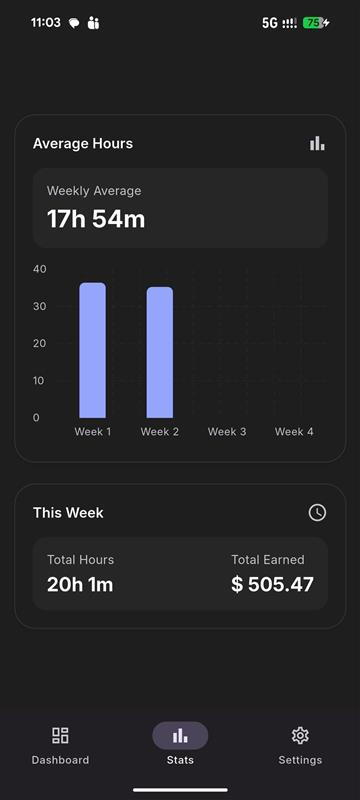

# Staytics 📊

**Staytics** is a Flutter-based mobile application designed to track and visualize statistics with a clean, modern UI and smooth performance.

---

## ✨ Features
- Built with **Flutter**
- Clean and minimal UI
- Fast & responsive performance
- Scalable architecture
- Ready for future analytics modules

---

## 📸 Screenshots

<p align="center">
  
  
  
  
  
  
  
  
  
  
  

</p>

> 📁 **Note:** Place all screenshots inside the `images/` directory at the root of the repository.

---

## 🚀 Getting Started

### Prerequisites
- Flutter SDK
- Dart
- Android Studio / VS Code

### Run the project
```bash
flutter pub get
flutter run
